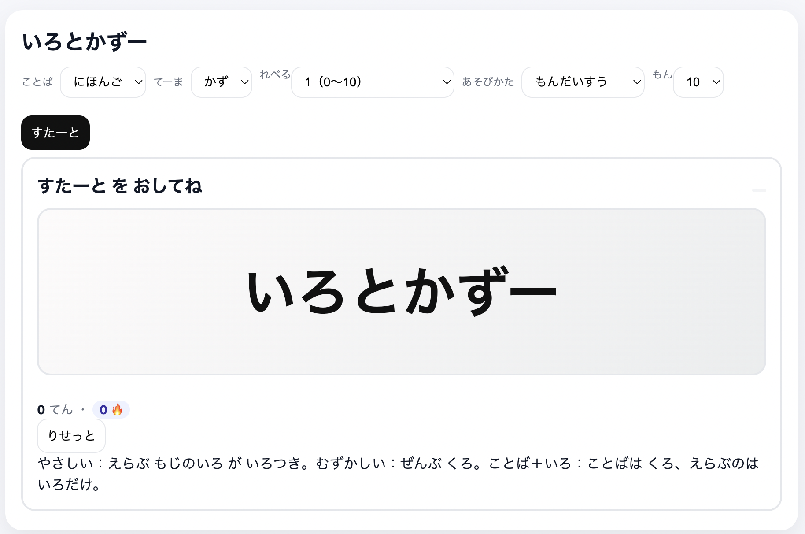
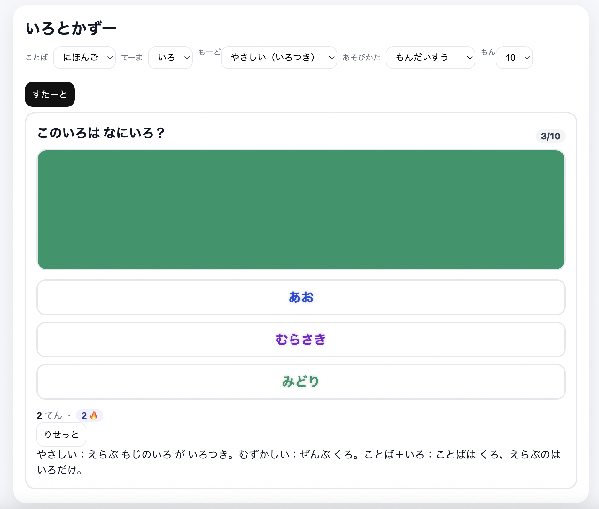
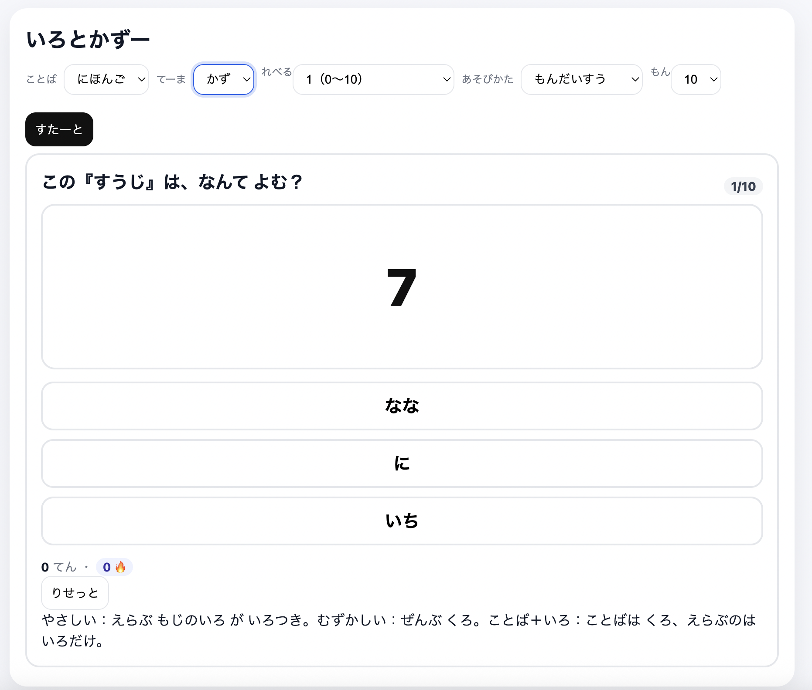

# いろとかずー — Irotokazoo

**いろ** と **かず** をクイズで楽しく学べる、こども向けの二言語（**日本語／英語**）ウェブアプリです。1つの HTML ファイルだけで動作し、インストールやサーバーは不要です。

ここから遊べます！: https://noguchi-yukie.github.io/irotokazoo/index.html

## ✨ 特長

* **てーま**

  * **いろ**：色名や色のボタンからえらぶ
  * **かず**：アラビア数字を ことば でよみとる
* **ことば切替**：**英語**／**日本語（ひらがな）** をいつでも切替
* **あそびかた**

  * **たいむあたっく**：30/60/90 秒で たくさん とく
  * **もんだいすう**：5/10/20 もん で せいかい率にちょうせん
* **いろモード**

  * **やさしい**（こたえの文字が いろつき）
  * **むずかしい**（こたえの文字が くろ）
  * **ことば＋いろ**（ことばは くろ、えらぶのは **いろだけのボタン**）
* **かずレベル**

  * レベル1：**0〜10**
  * レベル2：**0〜20**
  * レベル3：**0〜20＋とくべつ**（hundred／thousand／**million**／**billion**、日本語は **まん**／**おく**）
* **こども向けフィードバック**

  * 明るい**せいかい音**、はっきりした**ふせいかい音**（対応端末はバイブ）
  * もんだい正解時は**外枠が「ぽわわ」**（まんなかのキラキラは非表示）
  * **けっか画面のこうか**：

    * **100%** → 花火＋おいわいファンファーレ
    * **50%以下** → ざんねんファンファーレ（紙吹雪／花火なし）
    * **それ以外** → 紙吹雪＋ハッピーファンファーレ
  * **スコア／れんぞく回数／正解数/出題数** を表示
* **べんり**

  * **localStorage** で さいごの設定を記憶
  * 完全**オフライン**でOK（HTML/CSS/JSのみ）

> 🪄 ひみつ：タイトルを **5回タップ** すると「かずー風ファンファーレ」をオン／オフできます。

## 🧩 あそびかた

1. `index.html` をブラウザで開きます。
2. **ことば／てーま／あそびかた** をえらびます。
3. **すたーと** をおします。
4. **いろ** は色名や色ボタンを、**かず** は ことば をえらびます（例：「one」「いち」）。
5. さいごに けっか画面でスコアをかくにん（満点だと花火！）。

## 🚀 ローカルでの実行

インストール不要です。

```bash
git clone https://github.com/<your-username>/<your-repo>.git
cd <your-repo>
# `index.html` をブラウザで開くだけ（ダブルクリック／ドラッグ＆ドロップ）
```

## 📷 スクリーンショット（任意）

`docs/` に画像を入れて README から参照できます：






## 💡 デザイン＆アクセシビリティ

* **読みやすいコントラスト**：背景色に合わせて文字色を自動調整
* **いろボタン** には **ARIA ラベル** を付与（スクリーンリーダー対応）
* **ふせいかい**で **バイブ**（対応端末）
* **日本語はひらがな**中心で、幼児でも読みやすく

## 🛠 技術スタック

* **プレーンな HTML/CSS/JavaScript**
* 音：**Web Audio API**
* 花火：**Canvas**
* フレームワーク・ビルドツール不要

## 📁 構成

```
index.html        # 画面／スタイル／ロジックが1ファイルにまとまっています
```

## 🔧 カスタマイズ

* **色や名称**：`COLORS` を編集
* **とくべつな数**：`NUM_SPECIAL_JA` / `NUM_SPECIAL_EN` を編集
* **音**：`successChime()` / `wrongBuzz()` / 各ファンファーレの設定を調整
* **けっかの演出**：`endGame()` のしきい値やアニメーションを変更

## ✅ 動作環境

最新の Chrome / Edge / Safari / Firefox を推奨。モバイル（iOS/Android）でも動きます（音のため最初にタップが必要な場合があります）。

## 🤝 コントリビュート

PR も歓迎です。コードの変更時は：

1. **アクセシビリティ** と **こども向け体験** をたいせつに。
2. 小さく読みやすい関数で、依存ライブラリはなるべく無し。
3. **2言語／全モード**での動作を確認。

## 📜 ライセンス

MIT © あなた（自由に利用・改変・共有できます）。
